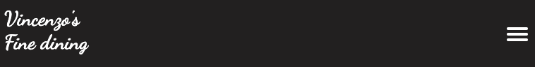
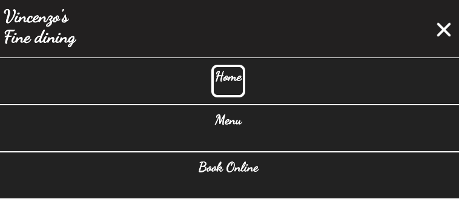
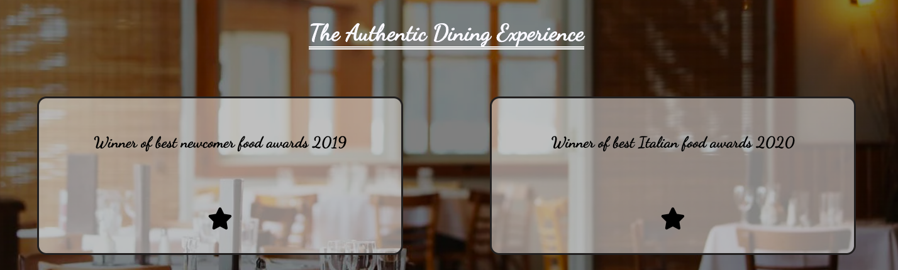
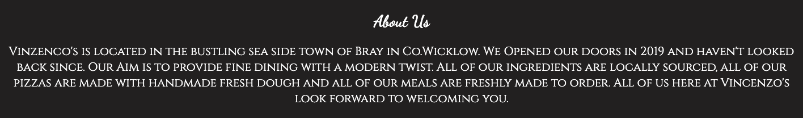
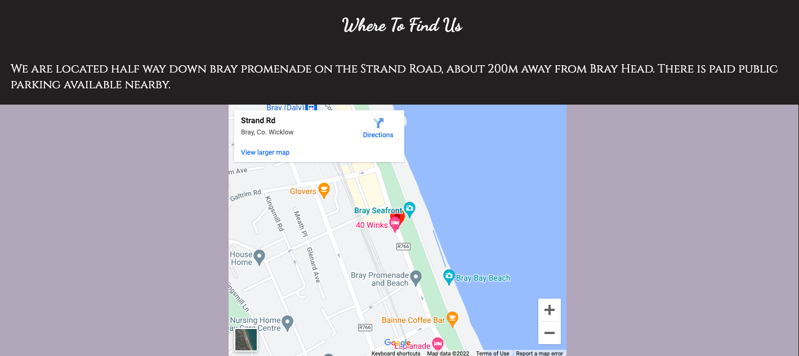
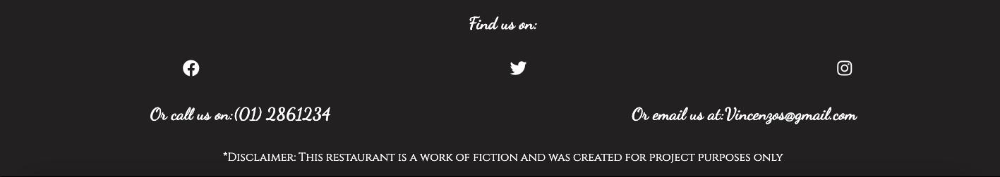
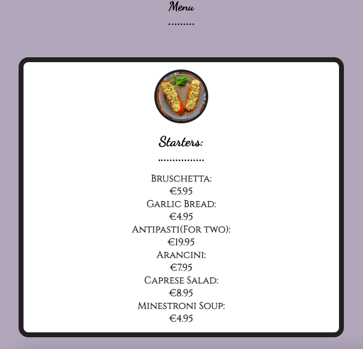
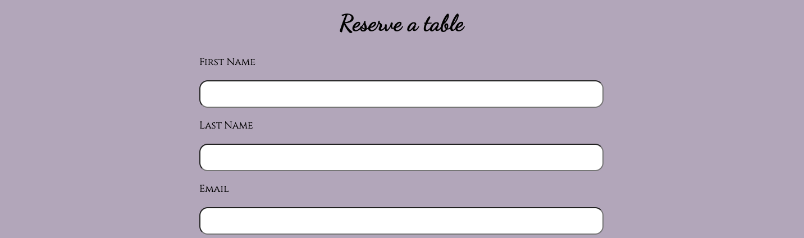
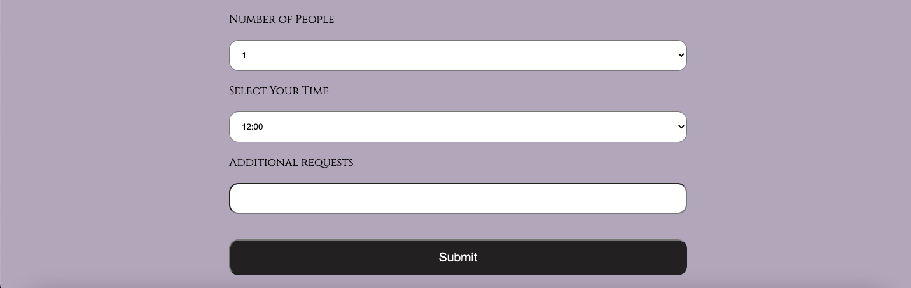

# Vincenzo's Fine Dining
Vincenzo's fine dining is a static 3 page website for a fictional Italian Restaurant, complete with a homepage, a menu page and a book online page.

## Features

### 1. Header
* The Header contains both the Vincenzos fine dining logo to the left of the page and the navigation bar to the right of the page.
* The colors were chosen in contrast with each other for easy readability
* The navigation bar links to the 3 pages Home, Menu and Book Online.There is a hover feature implemented which changes the color of the hovered over menu to Gray.There is also a current page feature which shows the user what page they are currently on with white lines around the link heading.

* The navigation bar transforms into a hamburger menu for tablet and mobile devices under 768 pixels wide.

* When clicked the menu opens into 3 columns with the page links.

### 2. Hero Photo section
* This section has a background image of a nice restaurant which gives the users an idea of what to expect when coming to the retaurant.

* The section has a heading with the slogan "The Authentic Dining Experience".

* This section includes 2 award transparent boxes which slide down from the top of the page when the page is loaded or refreshed.

### 3. About us section
* This section gives an overview of where the restaurant is located. It also gives a brief history of when the website opened its doors and tells the user that all ingredients are locally sourced and all meals are made fresh.

### 4. Opening hours section
* This section gives the opening hours of the restaurant.

### 5. Where to find us section
* This section gives an overview of exactly where the restaurant is loacated and gives information on nearby parking.

* The section also has an interactive map with a pin location for the restaurant.

### 6. Footer
* The footer contains 3 clickable links to Facebook, Twitter and Instagram, which all open in a new tab.

* The section also contains the restaurant contact phone number and contact email address.

* The bottom of the footer contains a disclaimer explaining that this website is fictional and made for project purposes only.

## 8. Menu Page

* This page contains an online menu for users to look at the meals available to order at the restaurant.

* The page contains 4 food sections. Starters, Mains, Pizza and Desserts with prices shown for each item and a small image at the head of each section.

## 9. Book online page
* This page has a form for users to enter their details to reserve a table online.

* The form collects the users First name, Last name, Number of people, preferred time slot and any additional requests.

