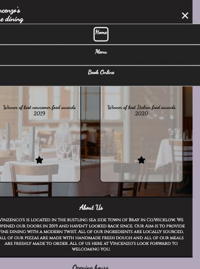

# Vincenzo's Fine Dining
Vincenzo's fine dining is a static 3 page website for a fictional Italian Restaurant, complete with a homepage, a menu page and a book online page.

Website developed by Sean Johnston for Code Institute Project Portfolio 1.

[Live Website Link](https://seanj06.github.io/Vincenzos-P1/)

## Table Of Contents

1. [Project Goals](#project-goals)

2. [User Experience (UX)](#user-experience)
   - [User Stories](#1-user-stories)
   - [Design Choices](#2design-choices)

3. [Features](#features) 
   - [Home Page](#home-page)
   - [Menu Page](#menu-page)
   - [Book Online Page](#9-book-online-page)

4. [Testing](#testing) 
   - [Validator Testing](#validator-testing)
   - [Accessibility](#accessibility) 
   - [Bugs](#bugs)
   - [Testing user stories](#testing-user-stories)

5. [Deployment](#deployment) 

6. [Credits](#credits)

7. [Acknowledgements](#acknowledgements)

## Project Goals

 - This project was created for Code Institute Project Portfolio 1 using both HTML and CSS.

 * Main goals of the site include:

   - Creating a site with consistent styling and easy accessibility for users throughout

   - Creating a site with all relevant and easy to find information for new and returning users.

   - Creating a site with full responsiveness for all screen and device sizes. 

   [Top of page](#vincenzos-fine-dining)

## User Experience (UX)

 ### 1. User Stories

   - #### First time users
     - As a first time user I want to be able to easily navigate the site.
     - As a first time user I want to be able to view the site on mobile and tablet devices as well as desktop.
     - As a first time user I want the site to be simple and easy to read.
     - As a first time user I want to be quickly able to understand the purpose of the site.
     - As a first time user I want to be able to look at the menu online.
     - As a first time user I want to be able to reserve a table online.
     - As a first time user I want to see if there is information on the restaurant location.

  - #### Returning users
    - As a returning user i want to see if the Menu is updated regularly.
    - As a returning user i want to see if there is any update to the opening and closing times of the restaurant.
    - As a returning user i want to see if there is any updates to the book onine page.

  ### 2.Design Choices

  - #### Colors
    
    
    - The 2 main background colors of the site are #B0A8B9(Heliotrope gray) and #222020(Eerie black).
    - The 2 main text colors are #222020(Eerie black) and #FFFFFF(White)
    - The hero text of the page is #F8F8FF(Ghost White)
    - I chose these colors because i felt they go well together in contrast and are easy to read.

 - #### Fonts

   - The 2 main fonts used in the site are 'Dancing script' and 'Cinzel' both taken from google fonts, with a fallback font of sans-serif.
   - The font used for headings is Dancing script.
   - The font used for all other text is Cinzel.   
 
[Top of page](#vincenzos-fine-dining)

## Features

### Home Page

- ####  Header

  - The Header contains both the Vincenzos fine dining logo to the left of the page and the navigation bar to the right of the page.
  - The logo can be clicked to bring the user back to the home page.
  - The colors were chosen in contrast with each other for easy readability for users
  - The navigation bar links to the 3 pages Home, Menu and Book Online.There is a hover feature implemented which changes the color of the hovered over menu to Gray.There is also a current page feature which shows the user what page they are currently on with white lines around the link heading.

- The navigation bar transforms into a hamburger menu for tablet and mobile devices under 768 pixels wide.

* When clicked the menu opens into 3 rows with the page links.

- ####  Hero Photo Section
  - This section has a background image of a nice restaurant which gives the users an idea of what to expect when coming to the retaurant.

  - The section has a heading with the slogan "The Authentic Dining Experience".

  - This section includes 2 award transparent boxes which slide down from the top of the page when the page is loaded or refreshed.

- ####  About Us Section

  - This section gives an overview of where the restaurant is located. It also gives a brief history of when the website opened its doors and tells the user that all ingredients are locally sourced and all meals are made fresh.

- ####  Opening Hours Section

  - This section gives the opening hours of the restaurant.

  - It is located on the home page so it is one of the first things the user sees when navigating the site.

- ####  Where To Find Us Section

  - This section gives an overview of exactly where the restaurant is located and gives users information on nearby parking.

  - The section also has an interactive map with a pin location for the restaurant.

  - This section is located just under the opening hours section for easy user accessibility.

- ####  Footer

  - The footer contains 3 clickable links to Facebook, Twitter and Instagram, which all open in a new tab.

  - The section also contains the restaurant contact phone number and contact email address.

  - The bottom of the footer contains a disclaimer explaining that this website is fictional and made for project purposes only.

  - The footer contains all relevant information for the user to contact the restaurant and keep up to date with updates by following social media accounts.

- ### Menu Page

  - This page contains an online menu for users to look at the meals available to order at the restaurant.

  - The page contains 4 food sections. Starters, Mains, Pizza and Desserts with prices shown for each item and a small image at the head of each section.

* The menu page changes layout to 1 section per line for devices 768 pixels and under.

- ###  Book Online Page

  - This page has a form for users to enter their details to reserve a table online.

  - The form collects the users First name, Last name, Number of people, preferred time slot and any additional requests.

* When the user submits their details into the form they are taken to a thank you page which confirms their booking and contains a link back to the home page.

[Top of page](#vincenzos-fine-dining)

## Testing

* I have tested this website works on all browser types.

* I have tested the site on various screen sizes and devices using devtools and confirmed it is responsive to all sizes.

* I have tested all of the clickable links work and open in new tabs and have tested that all form elements in the form section work correctly and are required to submit.

### Validator Testing

* No errors were shown when putting the code through both the w3c html validator and the jigsaw css validator.

- ### Accessibility

  - I confirm that all 3 pages return a high accessibility rating when running them through the lighthouse tool on devtools.

  

  

Home page lighthouse desktop

  
   

  

  

Home page lighthouse Mobile

  

  

  

Menu page lighthouse Desktop

  

  

  

Menu page lighthouse Mobile

  

  

  

Book online lighthouse Desktop

  

  

  

Book online lighthouse Mobile

  

  

  

Thank you lighthouse Desktop

  

  

  

Thank you lighthouse Mobile

  

### Bugs

 #### Solved Bugs

- When testing my site for responsiveness I realised that the text in all paragraph areas of the site was overflowing out of the page on smaller screen sizes. To fix this I changed font-size propertys from px to em for responsiveness. I also added 10 pixels of padding to each side of paragraph text.

   

Paragraph text css

  
  

- When adding my hamburger menu I noticed that when expanded the menu was wider than the page width which caused there to be a horizontal scroll bar. 

   

Hamburger menu overflowing

  
  

  - To fix this i removed any default margin and padding from the menu.

  

Hamburger menu after removing padding and margin

  
  

  

Hamburger menu css code

  
  

- When testing the menu page on smaller screen devices I noticed that the menu section containers were overflowing to the side of the screen. To fix this I added a media query to re size the containers appropriately.

- When testing the responsiveness of my site on different devices I realised that the footer on the Book Online page was not sticking to the bottom of the page on devices with heights of 1250 px or more. I concluded this was because the content on this page was not enough to fill the height of that size. I was unable to fix this bug by resizing the content as this made it look stretched.

  

Footer not sticking to bottom

  
  

  - I fixed the bug by adding a media query for devices with a min height of 1250 pixels to footer position: fixed and bottom: 0.

   
  

Media query code

  
  

  

Fixed footer

  
  

- When testing my site for responsiveness I noticed that in landscape mode on smaller screens the award boxes were overflowing onto the top of the section below.

  

Award boxes overflowing

  
  
 

  - To fix this i added an orientation:landscape media query and set the margin bottom to zero instead of the deafult keyframes -50 pixels.

  

Landscape media query code

   
  
 
  

- #### Unsolved Bugs

  - There are no known unsolved bugs.

  [Top of page](#vincenzos-fine-dining)

 ### Testing user stories

 - As a first time user i want to be able to easly navigate the site.

   - The navbar at the top of the site makes the site easily navigatable for all users, including the clickable logo which takes users back to the home page from any page on the site.

   

Top of page navbar

   
   
   

 -  As a first time user I want to be able to view the site on mobile and tablet devices as well as desktop.

   - The site is fully responsive to all screen sizes and devices. The navbar transforms into a hamburger menu for users on small screens. The menu page also transforms into 1 column of menu containers on smaller screens for easy user readability.

   

Hamburger menu

   
   

   

Menu page on mobile

   
   

- As a first time user I want the site to be simple and easy to read. 

  - The design of the site is split into 3 compact pages for easy user accessibility. 

  - The home page includes all relevant information for users including, The navbar with links to the 3 pages, The opening times of the restaurant, The location of the restaurant with an interactive map and the footer with the restaurant phone number, email address and link to social media sites.

  

Home Page Information

  
  

  - The menu page has a simple layout for users that inludes information on all of the menu items with prices broken into 4 sections, Starters, Mains, Pizza and Desserts.

  

Menu Page

  
  

  - The Book Online page has a simple layout which fits all of the forms on the users screen without need for scrolling.

  

Book Online Page

  
  

- As a first time user i want to be quickly able to understand the purpose of the site.

  - The Award section shows that the purpose of the website is to draw first time and returning users in to the restaurant  by showing them the awards received.

  

Award section

  
  

 
[Top of page](#vincenzos-fine-dining)

 ## Deployment

- This website was deployed on github pages using the following steps.
 
  - In the Github repository navigate to the settings tab.
  -  From the settings menu scroll down to pages and click it.
  - In the source section of the pages menu navigate to the branch section and select main.
  - Click save and the page will automatically refresh.

  - Navigate back to the pages section and the live link of the published  site will now be there.
  - [Link to site](https://seanj06.github.io/Vincenzos-P1/)

  [Top of page](#vincenzos-fine-dining)

## Credits

- ### Content

  - Template for readme taken from Code Institute sample readme.

  - Code institute gitpod template was used and taken from https://github.com/Code-Institute-Org/gitpod-database-config

  - Hamburger menu design taken from https://alvarotrigo.com/blog/hamburger-menu-css/ 

  - The 2 fonts used on this site "Dancing script" and "Cinzel" taken from https://fonts.google.com

- ### Media 

  - All site images were taken from https://www.pexels.com/

  - Social media logos on footer taken from https://fontawesome.com/

- ### Research

  - https://stackoverflow.com/ was used for any bugs which I could not solve. 

  - https://www.w3schools.com/ was used for research on various code syntax.

  [Top of page](#vincenzos-fine-dining)

  ## Acknowledgements

 - Thank you to my mentor Jubril who helped me along the way by guiding me in the right direction to complete the website.

 - Thank you to the Code Institute slack community and my classmates who helped with any issues i was having while making the website. 

  [Top of page](#vincenzos-fine-dining)

